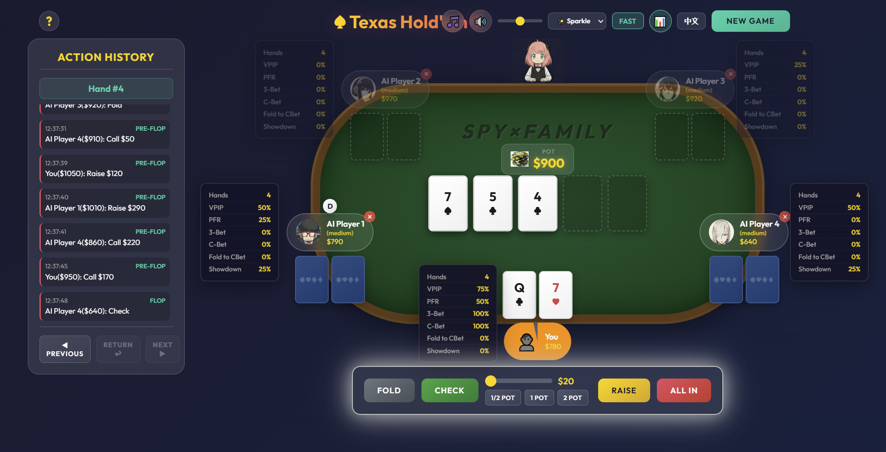

# Texas Hold'em Poker

A browser-based Texas Hold'em Poker game with animated UI, AI opponents, sound effects, and English/Chinese language support.



## Features

- Full Texas Hold'em gameplay with pre-flop, flop, turn, river, and showdown
- 4 AI opponents with adjustable difficulty
- Fast and slow game speed modes
- Cursor trail effects
- Sound effects and background music
- English and Chinese language toggle
- Hand history panel and winner animations

## Game Rules

### Objective

Win chips by making the best five-card poker hand or by forcing other players to fold.

### Gameplay Flow

1. Small blind and big blind are posted automatically.
2. Each player receives 2 hole cards.
3. The flop reveals 3 community cards.
4. The turn reveals the 4th community card.
5. The river reveals the 5th community card.
6. At showdown, the best hand wins the pot.

### Betting Actions

- Fold
- Check
- Call
- Raise
- All-In

## Hand Rankings

From highest to lowest:

1. Royal Flush
2. Straight Flush
3. Four of a Kind
4. Full House
5. Flush
6. Straight
7. Three of a Kind
8. Two Pair
9. One Pair
10. High Card

## Getting Started

### Prerequisites

- A modern web browser
- Docker and Docker Compose are optional for VPS deployment

### Local Installation

```bash
git clone https://github.com/semibluff888/TexasHoldemPoker2.git
cd TexasHoldemPoker2
```

Serve the project over HTTP, then open it in your browser.

Examples:

```bash
# Python
python -m http.server 8000

# Docker
docker compose up -d
```

Then visit:

```text
http://localhost:8000
http://localhost:1234
```

### VPS Deployment With Docker Compose

This repository includes a simple `docker-compose.yml` for static deployment with `nginx`.

```bash
cd /root
git clone https://github.com/semibluff888/TexasHoldemPoker2.git
cd TexasHoldemPoker2
docker compose up -d
```

After startup, visit:

```text
http://YOUR_SERVER_IP:1234
```

Notes:

- The included Compose file maps server port `1234` to container port `80`.
- This is a static deployment intended for simple testing.
- The online user count endpoint in `api/heartbeat.js` is not executed in this static `nginx` setup.

## Project Structure

```text
TexasHoldemPoker2/
|- index.html          # Main HTML structure
|- styles.css          # Styling and animations
|- game.js             # Game logic, AI, and translations
|- docker-compose.yml  # Simple VPS deployment config
|- api/                # Heartbeat API experiment
|- pic/                # Images and portraits
|- sound/              # Sound effects and music
`- README.md           # Project documentation
```

## Technical Details

### Technologies Used

- HTML5
- CSS3
- Vanilla JavaScript
- Web Audio API
- Docker Compose for simple VPS deployment

### Current Deployment Model

- The game itself runs as static files in the browser.
- `docker-compose.yml` serves those files through `nginx:alpine`.
- `/api/heartbeat` exists in the repository, but it is not active in the current static deployment.
- If the project later becomes a real-time multiplayer game, a Node-based backend deployment will be the more suitable direction.

## How to Play

1. Click `NEW GAME`.
2. Wait for your turn.
3. Choose Fold, Check, Call, Raise, or All-In.
4. Use the slider to adjust raise size.
5. Continue playing hand by hand.

## AI Behavior

- Easy: more passive, folds more often
- Medium: balanced decisions with more reasonable betting
- Hard: currently close to Medium

## Default Configuration

- Starting Chips: `$1000`
- Small Blind: `$10`
- Big Blind: `$20`
- Players: `1 human + 4 AI`

## License

This project is open source and available for personal and educational use.
